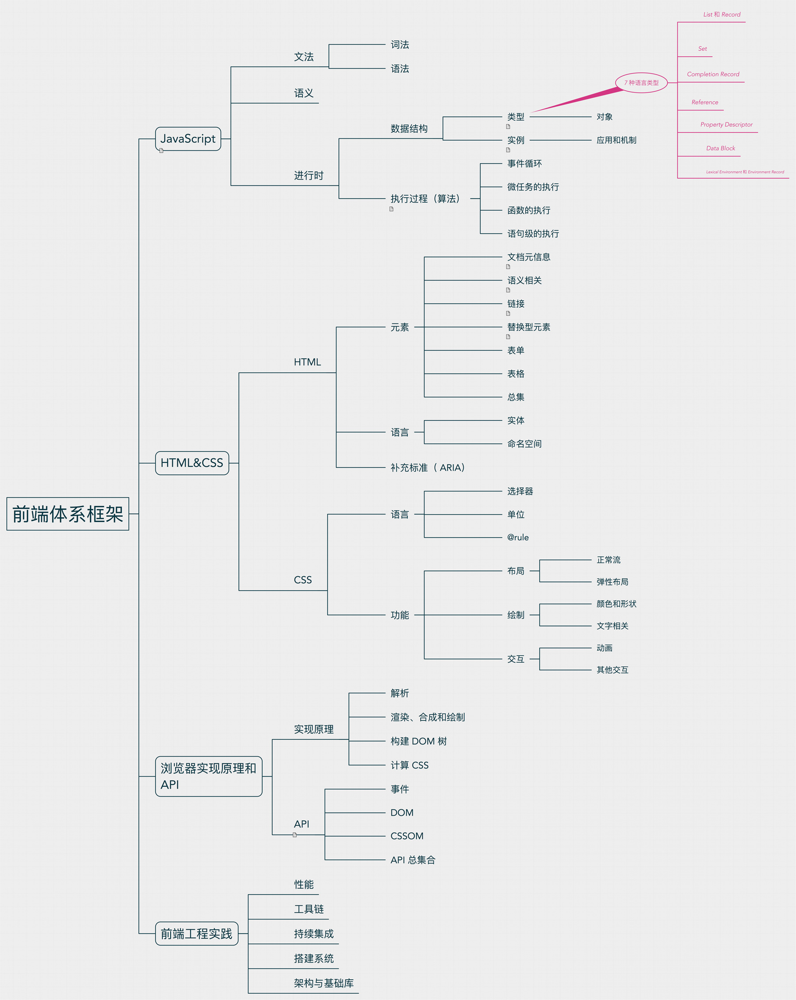

## 问题分类：
1. [mbp 问题汇总](https://github.com/kangkai124/blog/issues/1)
2. [ANSI Escape Sequences](https://github.com/kangkai124/blog/issues/2)
3. [前端工程化之 webpack 和 npm](https://github.com/kangkai124/blog/issues/3)
4. [js 知识点及问题汇总（一）](https://github.com/kangkai124/blog/issues/4)
5. [编辑器配置及插件](https://github.com/kangkai124/blog/issues/5)
6. [chrome 调试指南](https://github.com/kangkai124/blog/issues/6)
7. [vue 知识点及问题汇总](https://github.com/kangkai124/blog/issues/7)
8. [git 进阶指南](https://github.com/kangkai124/blog/issues/8)
9. [http 入门](https://github.com/kangkai124/blog/issues/9)
10. [2018 大厂面试题](https://github.com/kangkai124/blog/issues/10)
11. [css](https://github.com/kangkai124/blog/issues/11)
12. [每天一道题，早日 BAT](https://github.com/kangkai124/blog/issues/12)
13. [JavaScript 的精确计算](https://github.com/kangkai124/blog/issues/13)
14. [会 Proxy 这么了不起吗](https://github.com/kangkai124/blog/issues/14)
15. [vue-echarts 源码分析](https://github.com/kangkai124/blog/issues/15)
16. [命令式和声明式](https://github.com/kangkai124/blog/issues/17)
17. [面试清单收集](https://github.com/kangkai124/blog/issues/18)
18. [重学前端里的问题](https://github.com/kangkai124/blog/issues/19)
19. [收集好文](https://github.com/kangkai124/blog/issues/20)
20. [防抖和节流](https://github.com/kangkai124/blog/issues/21)

## 前端体系框架


## develop
```bash
npm install
npm run dev

# open http://localhost:8080/
```


## TODO

把文章按照体系分类，使用vuepress生成博客。